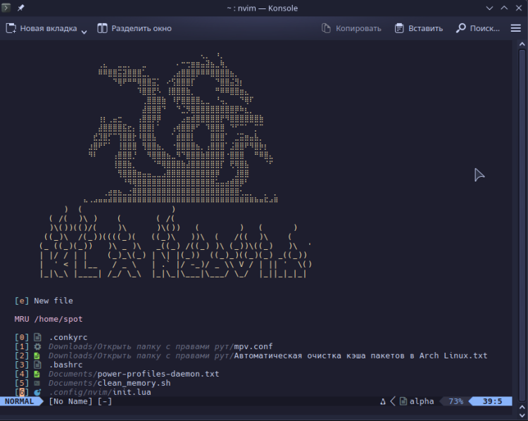
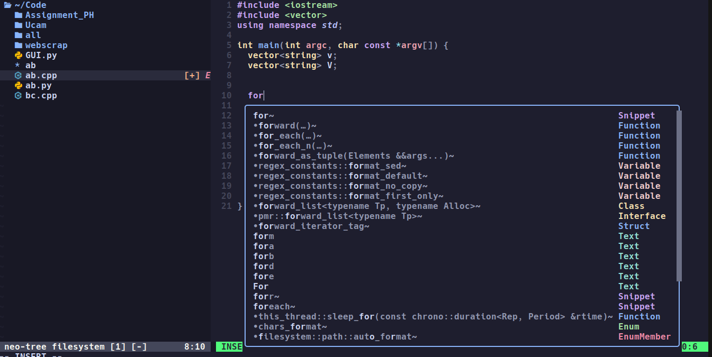
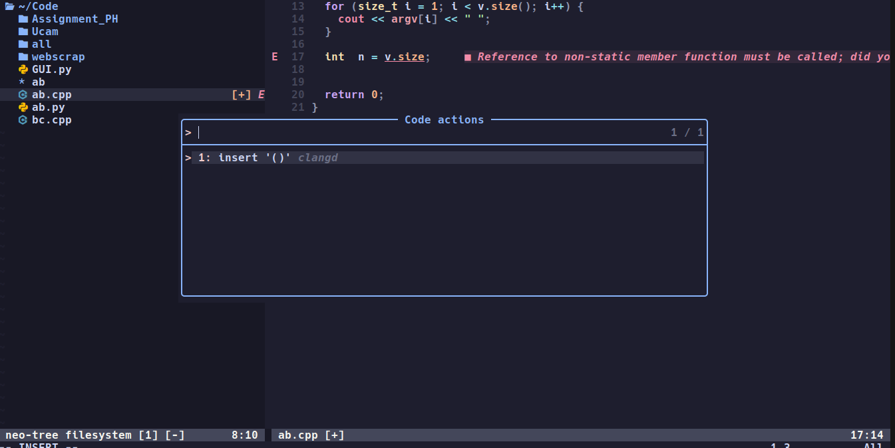

# Neovim Setup for Ubuntu

This repository contains a setup script to configure Neovim on Ubuntu. The setup includes installing Neovim, setting up a basic configuration, and installing plugins using Lazy and Mason.
## Screenshots
### Dashboards(alpha)

### File Explorer(Treesitter)

### Language Server

### Code Action

### File Finder (telescope) 

    

## Prerequisites

- Ubuntu (or any Debian-based distribution)
- `git` installed
-Neovim installed(version>=0.9.0)
### For Ubuntu 
**Using Snap**
  ```bash
  sudo snap install --beta nvim --classic
  ```
**Using APT**
  ```bash
  sudo apt-get install neovim
  ```
## Installation

1. **Clone the repository:**

   ```bash
   git clone https://github.com/nurul5801/nvim.git
   ```
2. **Install:**
   ```bash
   cd nvim
   chmod +x install.sh
   sudo ./install.sh
   ```
3. **important:**
    you should manually install 'clangd'-(for C/C++),'prettier'-(for JavaScript),'black'-(for python Lint),'ruff'-(for python Formatter) in nvim.Using 'Mason Install <NAME>' or "Mason" then select clangd,prettier,black,ruff and press 'i'. 

## Usage
After running the install.sh script, you can start Neovim by typing nvim in your terminal.The plugins should be installed and ready to use.
    
